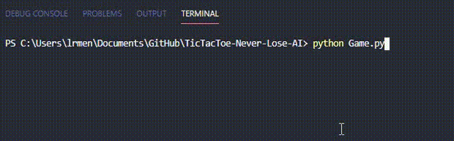
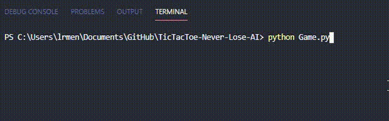

### The Algorithm
It is a simple AI algorithm based on 6 rules that makes the machine never lose the game.

### How It Works ?
 
Each rule is executed in order, the first that is satisfied is executed.
With this sequence of rules the machine never loses and it can win if the player misses.


### The Rules
```
machineRule1: IF Machine or Player can Win [ IF anyone needs 1 place to Win ] -> The Machine Fill That Place.
machineRule2: IF the Center is open -> Fill the center.
machineRule3: IF Player Fill a Corner -> Fill the opposite corner.
machineRule4: IF Player has two adjacent corners filled, fill in a space other than a corner.
machineRule5: IF none of the previous rules were used, fill in any a corner.
machineRule6: IF none of the previous rules were used, fill the first availabe place.
```

### How to Use:

Just Run The Python File in Console/Python: 
```python Game.py```

### Example of use:

##### A Machine Win:


##### A Tie Game:

